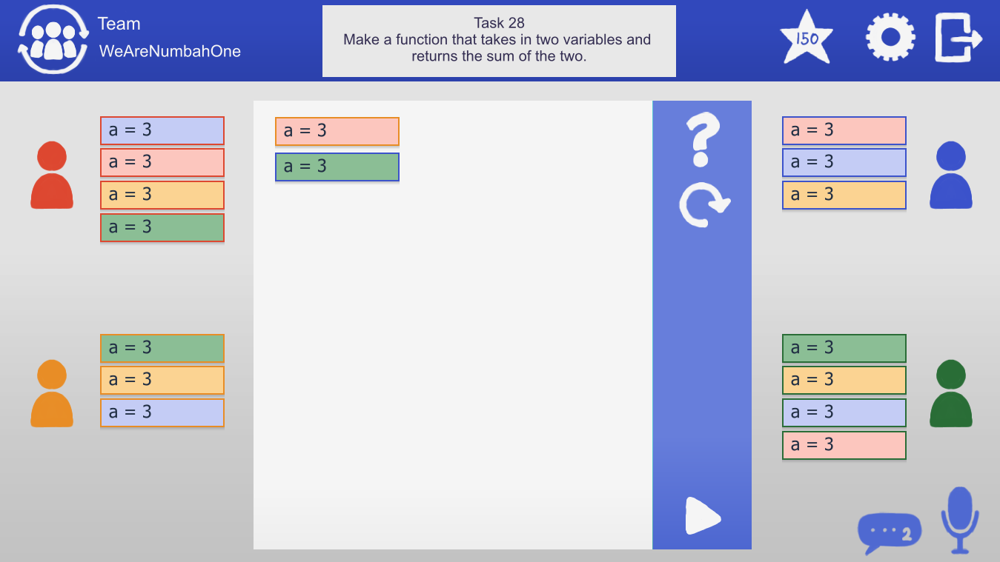
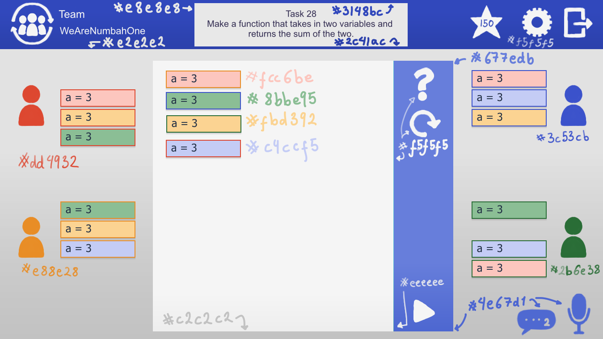

# Cooperative Parssons Problems (CPP)

## Oppdatert design (13.1.22)

NB: Bruker knapper og tekst på farger: #fcc6be (hint), #E2E2E2 (clear), #8BBE95 (submit)
Navn i #000000 under avatarene

## Arkitektur diagram(fra 6.12.21)

## Komponent diagram (fra 18.10.21)

