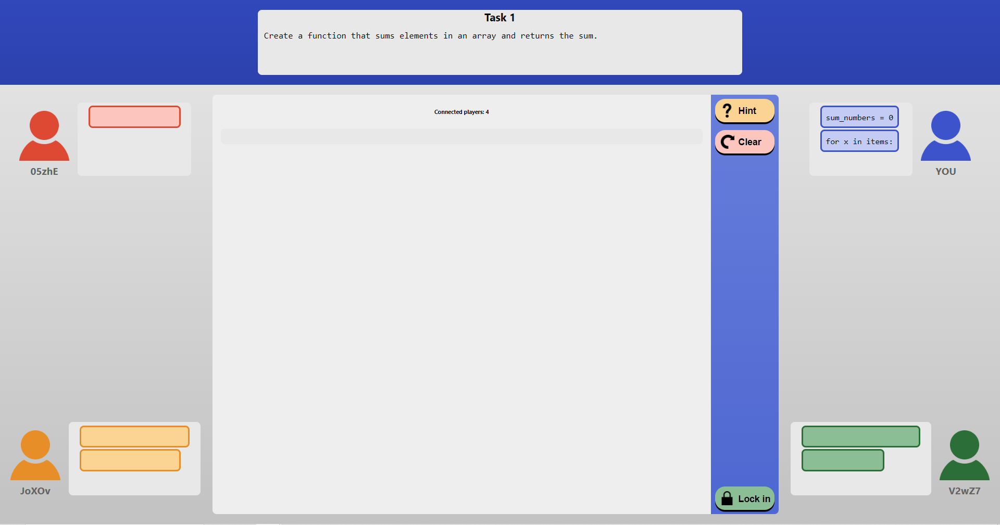

# Cooperative Parssons Problems (CPP)

<p align="center">
  
</p>


##  Prerequesites

```
node version > 14.15.5
npm version > 6.14.11
react version > 17.0.2,
```

## Start the game client (locally)

```
cd cpp\app
npm install
npm start
```
Acess the game in your browser at http://localhost:3000/ . <br />
Open multiple tabs for multiple clients. <br /> <br />

## Start the task-creation tool
```
cd cpp\create_tasks_app
npm install
npm start
```
Acess the tool in your browser at http://localhost:3000/ . <br />

### How to create tasks
<ol>
  <li>Select 'Create task'</li>
  <li>Write or copy/paste Python code into the editor</li>
  <li>Add any distractors by prepending the code line with '#$'</li>
  <li>Fill in other information about the task on the right side, including: description, hints and amount-of-attempts</li>
  <li>Save the task to your computer as a JSON file</li>
</ol>

### How to create task-sets
<ol>
  <li>Select 'Create set'</li>
  <li>Select the tasks from your local computer to be included</li>
  <li>Save the task-set to your computer as a JSON file</li>
</ol>

